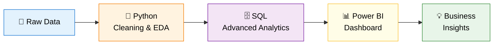

<div align="center">
 
# 🍽️ Eurofood Corp

### End-to-End Sales & Customer Analytics
 
[](https://www.python.org/)

[](https://www.postgresql.org/)

[](https://powerbi.microsoft.com/)

[](https://pandas.pydata.org/)

[]()
 
*Transforming raw transactional data into actionable business intelligence*
 
</div>
 
---
 
## 📑 Table of Contents
 
- [Overview](#-overview)

- [Business Objectives](#-business-objectives)

- [Tech Stack](#️-tech-stack)

- [Project Workflow](#-project-workflow)

- [Repository Structure](#-repository-structure)

- [Analytical Layers](#-analytical-layers)

  - [Python — Data Foundation](#1️⃣-python--data-foundation)

  - [SQL — Advanced Analytics](#2️⃣-sql--advanced-analytics)

  - [Power BI — Visualization](#3️⃣-power-bi--visualization)

- [Key Insights](#-key-insights)

- [Business Impact](#-business-impact)

- [Conclusion](#-conclusion)
 
---
 
## 🎯 Overview
 
End-to-end data analytics project built on **Eurofood Corp** transactional data.

The goal: convert raw sales data into a **decision-ready intelligence layer** for sales, marketing, and customer strategy teams.
 
> **Outcome at a glance**
> - 🧠 High-value customer segments identified via **RFM analysis**
> - 💎 Strategic role of **Members** confirmed in revenue stability
> - 📦 **Product-level profitability concentration** revealed
> - 📊 **Interactive Power BI dashboard** for continuous monitoring
 
---
 
## 🧭 Business Objectives
 
Understand and quantify the drivers of revenue and profitability across four dimensions:
 
| Dimension | Question Answered |

|----------|-------------------|

| 👥 **Customers** | Who are our most valuable customers and how should we segment them? |

| 📦 **Products** | Which products drive margin vs. volume? |

| 💳 **Loyalty Program** | What is the real impact of Members vs. Non-Members? |

| 📈 **Time Trends** | How does performance evolve across periods? |
 
---
 
## 🛠️ Tech Stack
 
| Layer | Tool | Purpose |

|-------|------|---------|

| **Data Processing** | `Python` · `Pandas` · `NumPy` | Cleaning, preprocessing, EDA |

| **Analytics Engine** | `SQL` | Joins, window functions, segmentation, RFM |

| **Visualization** | `Power BI` | Interactive dashboards & KPIs |

| **Versioning** | `Git` · `GitHub` | Project tracking & collaboration |
 
---
 
## 🔄 Project Workflow
 

 
---
 
## 📂 Repository Structure
 
```

eurofood-analytics/

│

├── 📁 data/                  # Raw and cleaned datasets

├── 📁 python/                # Notebooks (cleaning, EDA)

│   └── eurofood_eda.ipynb

├── 📁 sql/                   # Analytical queries

│   ├── rfm_segmentation.sql

│   ├── product_ranking.sql

│   └── revenue_trends.sql

├── 📁 powerbi/               # Power BI .pbix file

│   └── eurofood_dashboard.pbix

├── 📁 docs/                  # Screenshots & documentation

└── README.md

```
 
---
 
## 🔍 Analytical Layers
 
### 1️⃣ Python — Data Foundation
 
**Scope:** preparing the dataset and surfacing first-look patterns.
 
- ✅ Data cleaning & preprocessing (missing values, types, duplicates)

- ✅ Exploratory Data Analysis on revenue, profit & customer behavior

- ✅ Initial trend detection
 
> **Findings**
> - Members exhibit **more stable** purchasing behavior than non-members
> - Revenue distribution is **relatively balanced** across product categories
> - **Significant variability** in customer lifetime value
 
---
 
### 2️⃣ SQL — Advanced Analytics
 
**Scope:** building the analytical core with production-grade queries.
 
- 🔗 Complex joins & aggregations

- 🪟 Window functions and ranking logic

- 💰 Revenue & profit segmentation

- 🎯 **RFM** (Recency · Frequency · Monetary) customer scoring
 
> **Findings**
> - Clear segmentation into **Best**, **Loyal**, and **At Risk** customers
> - Identification of frequent and high-value customers
> - Product-level performance and profitability ranking
 
---
 
### 3️⃣ Power BI — Visualization
 
The dashboard is structured into **three analytical views**, each targeting a specific stakeholder need.
 
| View | Purpose | Key Visuals |

|------|---------|-------------|

| 📈 **Sales Overview** | Track global performance | Revenue vs. Profit trends · Category contribution · Loyalty impact |

| 📦 **Product Insights** | Identify top performers | Profitability matrix · Margin comparison · Best-sellers |

| 👥 **Customer Insights** | Understand the customer base | Segmentation · Members vs. Non-Members · High-value customers |
 
---
 
## 💡 Key Insights
 
| # | Insight | Strategic Implication |

|---|---------|----------------------|

| 1 | Members generate **more predictable** revenue streams | Reinforce loyalty program investments |

| 2 | A **small subset of products** drives most of the margin | Optimize product portfolio & shelf space |

| 3 | **At Risk** segment represents a recoverable revenue pool | Launch targeted re-engagement campaigns |

| 4 | High-value customers concentrate purchases over time | Personalize offers for top RFM segments |
 
---
 
## 🚀 Business Impact
 
- 🎯 **Sharper customer segmentation** for marketing campaigns

- 💰 **Identification of key revenue drivers** at customer & product level

- 📦 **Product portfolio optimization** opportunities

- 💳 **Strategic insights** to enhance the loyalty program
 
---
 
## 🏁 Conclusion
 
This project illustrates a **complete end-to-end analytics workflow** — from raw data to executive-ready dashboards — combining the strengths of **Python**, **SQL**, and **Power BI** to deliver tangible business intelligence.
 
<div align="center">
 
---
 
⭐ *If you found this project useful, feel free to star the repo!*
 
**Made with 💙 by Tony Aires**
 
</div>

 
